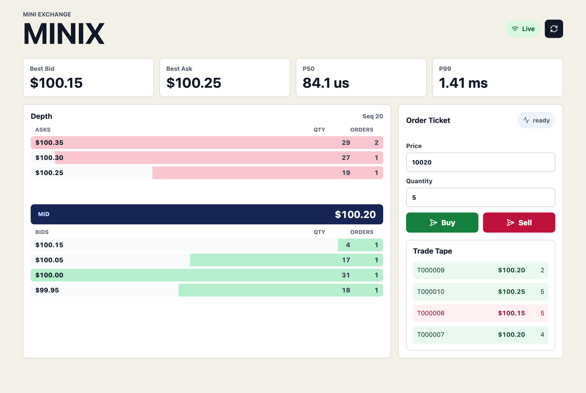

# Mini Exchange

[](https://github.com/jaydeepbajwa/mini-exchange/actions/workflows/ci.yml)

A small limit order book with price-time priority matching, a WebSocket market-data feed, and a React depth dashboard.



*Real screenshot of the seeded demo — `docker compose up`, wait a few ticks, and this is what you get.*

## Quickstart

```bash
git clone https://github.com/jaydeepbajwa/mini-exchange.git
cd mini-exchange
docker compose up --build
```

Open http://localhost:5173. The API runs on http://localhost:8000 and starts with seeded orders plus a deterministic demo flow so the depth chart, trade tape, and latency metrics move without external data.

Local API-only run:

```bash
python3 -m venv .venv && source .venv/bin/activate   # PEP 668: install into a venv
pip install -e .
mini-exchange-api
```

Local dashboard run:

```bash
npm --prefix frontend install
npm --prefix frontend run dev
```

## How Matching Works

The book is two dicts of `price -> deque[RestingOrder]` — one per side. Price
priority comes from scanning for the best opposite price (`max` of bids /
`min` of asks); time priority comes from the deque itself: makers are appended
on arrival and filled from the front, so arrival order *is* the data
structure. An incoming limit sweeps the opposite side while it still crosses,
emitting one trade per maker at the **maker's** price (the taker keeps the
price improvement), then rests any remainder. Everything is integer ticks and
integer lots; no floats anywhere in the matching path.

## Measured Performance

From `python3 scripts/bench.py` (100,000 seeded pseudo-random limit orders,
timed around `submit_limit()` only) on an Apple-silicon laptop, Python 3.12:

| metric | value |
|---|---|
| throughput | ~187,000 orders/sec |
| p50 latency | 3.8 µs |
| p99 latency | 16.1 µs |

Run the script yourself to reproduce on your hardware — the numbers in this
table came from that exact command, nowhere else. For context: this is a
dict-scan Python engine (see Honest Limits), so treat these as "what plain
data structures buy you," not venue-grade performance.

## What It Proves

- Price-time matching: best price wins first, FIFO wins within a price level.
- Live market-data path: FastAPI accepts orders and broadcasts snapshots over WebSockets.
- Trading UI signal: React renders depth, tape, and p50/p99 engine latency without pretending this is a production exchange.

## API

- `GET /health` returns service status and top of book.
- `GET /snapshot` returns the current depth and latency snapshot.
- `POST /orders` accepts `{ "side": "buy", "price": 10020, "quantity": 5 }`.
- `POST /reset` reloads the seeded book.
- `WS /ws/market-data` streams snapshots, order acks, trades, and latency stats.

Prices are integer ticks in cents. `10025` means `$100.25`; this keeps the matching engine free of floating-point rounding surprises.

Example — a marketable buy that fills against the seeded book:

```bash
curl -s -X POST localhost:8000/orders \
  -H "Content-Type: application/json" \
  -d '{"side": "buy", "price": 10020, "quantity": 5}'
```

Abridged real response (the payload also carries the full depth snapshot and
latency stats):

```json
{
  "type": "order_ack",
  "ack": {
    "order_id": "O000009",
    "status": "filled",
    "requested_quantity": 5,
    "rested_quantity": 0,
    "latency_us": 49.0,
    "trades": [{"trade_id": "T000001", "price": 10020, "quantity": 5}]
  },
  "snapshot": {"best_bid": 10010, "best_ask": 10020}
}
```

## Design Decisions

1. **Integer ticks and integer lots.** The engine never compares floats, which keeps price crossing and tests easy to reason about.
2. **Synchronous matching core, async edges.** The order book is plain Python data structures behind a FastAPI lock. That makes the invariant testable while still giving the dashboard a live WebSocket feed.
3. **Latency measured around the engine call.** The dashboard reports p50/p99 for matching work, not network round trips, so the numbers stay tied to the code this repo is trying to prove.

## Tests

```bash
python3 scripts/lint.py
python3 -m compileall mini_exchange scripts tests
python3 -m unittest discover -s tests -p "test_*.py"
npm --prefix frontend install
npm --prefix frontend run build
```

The core invariant under test is price-time priority: same-price resting orders fill FIFO, better-priced orders fill before older worse-priced ones, and both taker directions are exercised. A mixed-flow test also asserts the book never crosses after any order, and quantity is conserved between trades and resting remainder on every ack.

## Honest Limits

- This is a single-process toy exchange, not a fault-tolerant trading venue.
- **Limit orders only.** No market orders, no cancel, no cancel/replace — the
  only way to clear resting orders is `POST /reset`. Cancel support is the
  first thing I'd add next; it forces order IDs to become addressable book
  positions, which is the interesting part.
- There is no persistence, replay log, authentication, or risk engine.
- The WebSocket feed emits full snapshots instead of compact deltas.
- Matching uses dictionary scans for best price, which is clear for a portfolio project but not the right data structure for a high-throughput venue.

## Writeup

Build notes are in [docs/blog-post.md](docs/blog-post.md): what broke, what I would redo, and how this maps back to my LoopFX trading-infrastructure story.

## License

MIT
