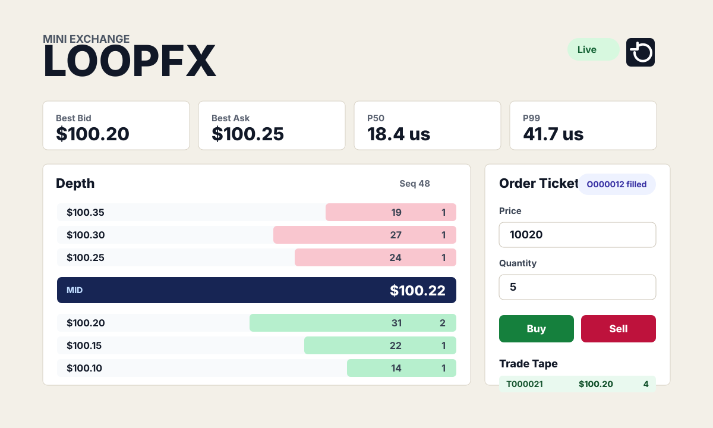

# Mini Exchange

[](https://github.com/jaydeepbajwa/mini-exchange/actions/workflows/ci.yml)

A small limit order book with price-time priority matching, a WebSocket market-data feed, and a React depth dashboard.



## Quickstart

```bash
git clone https://github.com/jaydeepbajwa/mini-exchange.git
cd mini-exchange
docker compose up --build
```

Open http://localhost:5173. The API runs on http://localhost:8000 and starts with seeded orders plus a deterministic demo flow so the depth chart, trade tape, and latency metrics move without external data.

Local API-only run:

```bash
python3 -m pip install -e .
mini-exchange-api
```

Local dashboard run:

```bash
npm --prefix frontend install
npm --prefix frontend run dev
```

## What It Proves

- Price-time matching: best price wins first, FIFO wins within a price level.
- Live market-data path: FastAPI accepts orders and broadcasts snapshots over WebSockets.
- Trading UI signal: React renders depth, tape, and p50/p99 engine latency without pretending this is a production exchange.

## API

- `GET /health` returns service status and top of book.
- `GET /snapshot` returns the current depth and latency snapshot.
- `POST /orders` accepts `{ "side": "buy", "price": 10020, "quantity": 5 }`.
- `POST /reset` reloads the seeded book.
- `WS /ws/market-data` streams snapshots, order acks, trades, and latency stats.

Prices are integer ticks in cents. `10025` means `$100.25`; this keeps the matching engine free of floating-point rounding surprises.

## Design Decisions

1. **Integer ticks and integer lots.** The engine never compares floats, which keeps price crossing and tests easy to reason about.
2. **Synchronous matching core, async edges.** The order book is plain Python data structures behind a FastAPI lock. That makes the invariant testable while still giving the dashboard a live WebSocket feed.
3. **Latency measured around the engine call.** The dashboard reports p50/p99 for matching work, not network round trips, so the numbers stay tied to the code this repo is trying to prove.

## Tests

```bash
python3 scripts/lint.py
python3 -m compileall mini_exchange scripts tests
python3 -m unittest discover -s tests -p "test_*.py"
npm --prefix frontend install
npm --prefix frontend run build
```

The core invariant under test is price-time priority. Same-price resting orders fill FIFO, and better-priced orders fill before older worse-priced orders.

## Honest Limits

- This is a single-process toy exchange, not a fault-tolerant trading venue.
- There is no persistence, replay log, authentication, or risk engine.
- The WebSocket feed emits full snapshots instead of compact deltas.
- Matching uses dictionary scans for best price, which is clear for a portfolio project but not the right data structure for a high-throughput venue.

## Writeup

Build notes are in [docs/blog-post.md](docs/blog-post.md): what broke, what I would redo, and how this maps back to my LoopFX trading-infrastructure story.

## License

MIT
